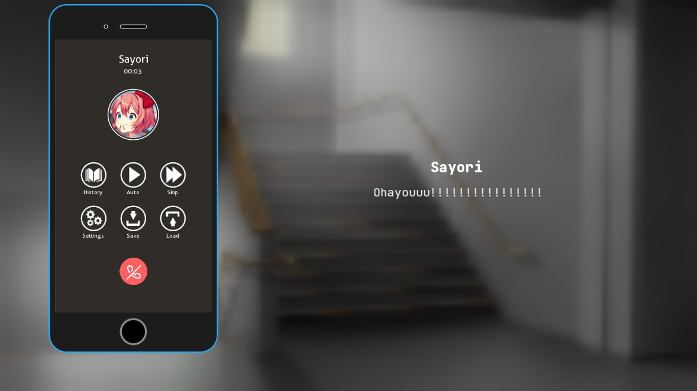

Built-in Screens
================

*This framework comes with its set of built-in screens.*

``phone()``

``phone_contacts()``

``phone_call_history()``

``phone_calendars()``

``phone_call(video=False)`` *(used during phone calls)*

``phone_discussion()`` *(used during phone discussions)*

